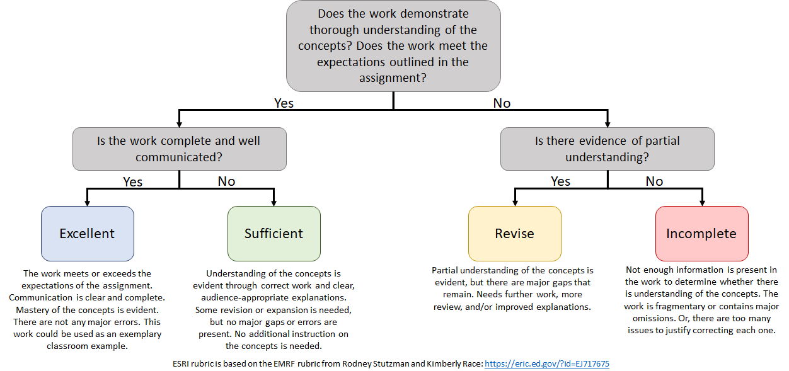

Project 6
================

Remember that Projects do not have fixed deadlines. You can work on this
item until you are ready to submit it. However, remember the [**two
items per
week**](https://sta518.github.io/courses/course-grading/revision/#projects)
policy.

## Overview

This assignment will extend your function writing and `{purrr}` skills.
In addition, you will use `{infer}` package (this is detailed within the
`project06.Rmd` file). If you run into any issues we should be able to
get them workout out.

Learning Targets associated with this Project:

  - **FP.1** - **CORE** I can write a function that simplifies a common
    analysis task
  - **FP.2** - **CORE** I can use functional programming to apply a
    function to each element in data source
  - **FP.3** - I can implement resampling methods to make conclusions
    about data

Your final report should interweave code, output, and narrative. All
work should be done within your `project06.Rmd` file and your final
report will be the resulting knitted `project06.md` file.

You will submit a link to your finalized `project06-<username>` repo
through Bb. This done at the same place where you created this repo.

## Getting Help

You are allowed to use books or searching online resources like
Google/Bing or StackOverflow to find suggestions during this Project,
but **you must cite any resource** that you use beyond the R4DS textbook
and class activities (that is, you do not need to site R4DS or the class
activities). You may not communicate with any person other than your
instructor. Violations of this policy include *any* consultation with
other students or former students, including Stat Tutoring Center
tutors; using work from another student or former student; submitting
the problem to a online help site like StackOverflow, Chegg, Coursehero,
or any online forum. All such violations will be treated as academic
dishonesty and will *minimally* result in a grade of **I** and being
banned from revising the work.

If your instructor feels that a question you ask would benefit the
entire class (e.g, it will clarify a general item), you will be
redirected to post that as an Issue in the community repo. **You may
only post questions about this project on the community repo if
instructed to do so.** You may not share information with other people
about the content of this Project unless explicitly approved by your
instructor.

## Evaluation

Projects are graded using the
[“*ESRI*”](https://sta518.github.io/courses/course-grading/grading/#projects)
marking system.

A grade of **E** or **S** requires all of the following to be met:

  - You committed/pushed everything in your repository including your
    `project06.md` file. Repos that do not contain a `project06.md` file
    will be automatically graded **I**.
  - For Tasks 3-5, you use efficient coding practices and follow the
    coding style guide that we have been using in the activities to
    produce the desired output.
  - All discussion or descriptions are clear and completely discuss
    important details. Your discussions or descriptions should be
    written for someone with a STA 215 (Introductory Statistics)
    background, but they do not have any experience with R.
  - There are no errors in your code.

A grade of **E** is given if all the stated expectations are met and the
work is of superior quality in terms of the clarity of explanations and
work, appearance of the report, and precision of code.

Correct computation with insufficient explanation will need to be
revised (**R**) and may receive an **I** grade.

## ☑️ Task 1: Git-ing Started

1.  In the root of the Project 8 GitHub repository (i.e.,
    `STA518-<section>-Fall20/project06-<username>`), click on the “Code”
    button.

<!-- end list -->

  - Verify that the drop-down says **Clone with HTTPS** (this is
    *probably* the default view; otherwise, select “Use HTTPS”)
  - Click on the clipboard-icon to copy the repo URL

<!-- end list -->

2.  Create a new Project. You can do this by clicking on the
    new-project-icon  or through the
    menus (File \> New Project…).

<!-- end list -->

  - In the *New Project Wizard* pop-up, select **Version Control** on
    the *Create Project* screen, then select **Git** on the *Create
    Project from Version Control* screen.
  - On the *Clone Git Repository* screen, paste the URL of your GitHub
    repository from (1) into the *Repository URL* dialog box. It should
    look like:
    `https://github.com/STA518-<section>-Fall20/project06-<username>.git`
  - The *Parent directory name* dialog box will be automatically
    populated with your repository name. It should look like:
    `project06-<username>`
  - In the *Create project as subdirectory of* dialog box, click on
    **Browse**.
  - In the *Choose Directory* pop-up, **Browse** to the class-level
    folder you created in Activity 1.2 (and possibly the `activities`
    folder) and click **Choose**.
  - Verify that the *Create project as a directory of* dialog box
    contains the folder location that you previously specified, then
    click on **Create Project**. You should then be asked to login with
    your GitHub credentials on a *Clone Repository* pop-up window - **do
    this**. **This *should* be the last time you need to provide your
    GitHub credentials.**

<!-- end list -->

3.  After a few seconds, your RStudio session will refresh and you
    should be in your newly created RStudio Project\! Remember that this
    is YOUR workspace and your Team Members will ONLY see what you have
    done once you commit/push to GitHub.
4.  In the **Git** pane (upper-right-hand pane of your RStudio session,
    the tab three to the right of **Environment**), click on
    new-branch-icon  (on the
    right-hand side of this pane’s tool bar).

<!-- end list -->

  - In the *New Branch* pop-up, name the branch your GitHub `username`
    and click **Create**. I hope that you are not prompted to provide
    your log-in with your GitHub credentials. 🤞

## ☑️ Task 2: Edit the YAML

Open the `project06.Rmd` file from the **Files** pane (lower-right-hand
pane).

At the top of this file (nested between a pair of `---` lines) edit the
`author` YAML item to contain your preferred first and last name. Save
your `.Rmd` file by either clicking on the floppy-disk-icon or
“Knitting” your file again.

Commit/push your changes.

**NOTE**: I have not loaded any packages for you.

## ☑️ Task 3-5: Complete the Report

Work through the Project 6 report. I provide you with some general R
code chunks, but you will need to add more as you need them. I recommend
that you also push your changes frequently.

## ☑️ Task 6: Submit your Project 6

Back at your Project 6 repo, copy the address to your repo’s root
directory. It should look like
`https://github.com/STA518-<section>-Fall20/project06-<username>`.

Go to the Project 6 assignment on [Bb](https://mybb.gvsu.edu). Paste
your repo’s link in the submission box as a *clickable* link and I will
have it assessed shortly.
