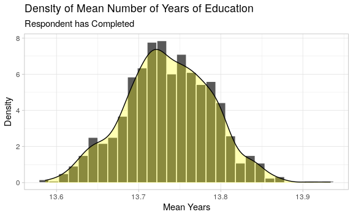
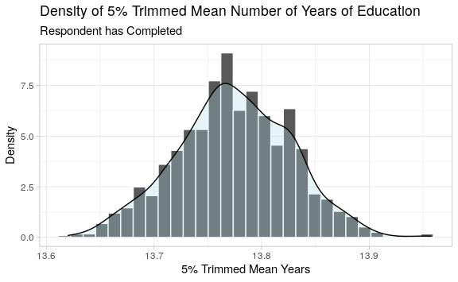
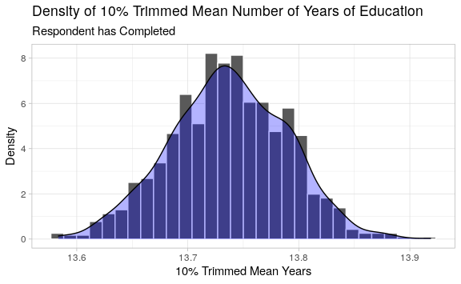
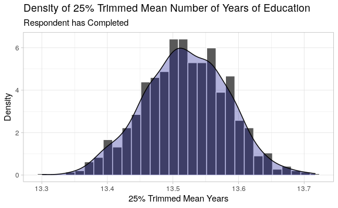
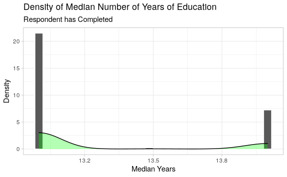

Project 6
================
Jessica Tagudar

## Task 3: Set-up

In this activity you will be bootstrapping, which means we’ll be
generating random samples. First, you will need the `{tidyverse}` and
`{infer}` packages.

``` r
knitr::opts_chunk$set(error = TRUE, fig.width = 6, fig.asp = 0.618)
# LOAD ANY PACKAGES YOU NEED
library(tidyverse)
library(infer)
```

### Data

As previously mentioned, you will work with the 2016 GSS data. The GSS
gathers data on contemporary American society in order to monitor and
explain trends and constants in attitudes, behaviors, and attributes. In
this lab we analyze data from the 2016 GSS, using it to estimate values
of population parameters of interest about US adults. The public release
of this data contains 935 variables and 2,867 observations. This is not
a massive data set, but it is a fairly large that we need to consider
how we handle it in our workflow.

The size of the data file we’re working with it 34.3 MB (the professor
evaluations data was 45KB) which means the GSS data is a little over 750
times the size of the evaluations data. That’s a big difference\!
Remember that GitHub will produce a warning when you push files larger
than 50 MB, and it will not allow files larger than 100 MB (see [GitHub
Help - Working with large
files](https://help.github.com/articles/working-with-large-files/)).
While this file is smaller than both of these limits, it’s still large
enough to not push to GitHub. Therefore, I have uploaded this dataset on
Blackboard where you created this repository.

Again, this is where the `.gitignore` file comes into play. If you open
the `.gitignore` file in your project repo, you’ll see that the data
file, `gss2016.csv`, is already listed there.

  - You will need to download the `gss2016.csv` from Blackboard.  
  - Create a `/data` folder in your RStudio Cloud project and upload the
    `gss2016.csv` file.
  - Note that even though you made a change in your files by adding the
    data, `gss2016.csv` does not appear in your Git pane. This is
    because it’s being ignored by git.

Below is a `load-data` R chunk that reads in this file.

``` r
gss <- read_csv(here::here("data","gss2016.csv"),
                na = c("", "Dont know", "Don't know",
                       "No answer", "Not applicable", "NA"),
                guess_max = 2867) %>%
  select(harass5, educ, born, polviews, advfront)
```

Notice that this chunk does three things:

1.  `na = c(...)`: I specified some additional values that `read_csv()`
    should treat as missing values.
2.  `guess_max`: In the documentation for `read_csv()` you see that the
    function uses the first 1,000 observations from a data frame to
    determine the classes of each variable. However, in this data frame,
    we have numeric data within the first 1,000 rows, but then something
    like `"8 or more"` in later rows. Therefore, without specifically
    telling R to scan all rows to determine the variable class, we would
    end up with some warnings when loading the data. Feel free to
    experiment with this by removing the `guess_max` argument.
3.  `select`: In this Activity, I know which variables you will be using
    from the data, so you can just select those and not carry along the
    entire dataset. This is extremely helpful when working with large
    data sets. Now, you might be wondering how you would know ahead of
    time which variables you will be working with. Valid and you
    probably won’t know. However, once you make up your mind, you can
    always go back and add a `select()` so that from that point on you
    can benefit from faster computation in your analysis.

## Task 4: Education

Our variable of interest for this lab is going to be `educ` which is the
number of years of education the respondent has completed. Plot a
histogram of `educ` with an overlaying density. Comment briefly on the
shape, center, and spread.

``` r
gss %>%
  ggplot(mapping = aes(x = educ)) +
  geom_histogram(aes(y = stat(density)), color = "white", binwidth = 1) +
  geom_density(fill = "red", alpha = 0.3) +
  theme_light() +
  labs(
    title = "Density of Number of Years of Education",
    subtitle = "Respondent has Completed",
    x = "Years",
    y = "Density"
  )
```

    ## Warning: Removed 9 rows containing non-finite values (stat_bin).

    ## Warning: Removed 9 rows containing non-finite values (stat_density).

<!-- -->

**The shape of the density curve is not symmetrical. The center leans
towards the left side of the curve. The data is rightly skewed. The
spread is more distributed on the right end of the curve.**

**For the histogram creation, I used a borderline of white to make the
data stand out. I also used theme\_light() for this same reason. I used
a density fill color of red to contrast against the gray data. An alpha
of 0.3 was used to see both the density curve and histogram data.
Respective labels were also added. The same format was used for future
histograms.**

Suppose we’re interested in making inference about the typical number of
years of education that a person has completed and this is our
representative sample. Is the mean a good statistic to use here to
describe the typical value of education? Why or why not?

**I think that the mean would be a good statistic to use here to
describe the typical value of education. As seen in the plot above, the
number of years of education is fairly skewed and non-normal. I think
that the mean would be a statistic to level out, or normalize this data.
The mean is also known as the average, which I think would be a better
representation of the data.**

Recall from your introductory statistics course that a one-sample
*t*-test requires that the sample mean is approximately Normally
distributed. Does this assumption seem reasonable for the mean number of
years of education? Why or why not?

**This assumption does not seem reasonable for the plot above. According
to the density plot above, the data is not bell-shaped and/or
symmetrical. The data would be considered normal if it was bell-shaped
and symmetrical. For the mean number of years of education, the
assumption of normal distribution would seem reasonable. I think that
the mean (average) would be a great statistic to normalize the data.**

Since our sample size is so large, the distribution of the *sample mean*
is approximately Normal (the CLT\!). The `t.test(df$var)` function can
be used to do a one-sample *t*-test and to find a 95% confidence
interval for the mean number of years of education that US adults
complete. Construct a 95% confidence interval for the mean number of
years of education that US adults complete.

``` r
t.test(gss$educ)
```

    ## 
    ##  One Sample t-test
    ## 
    ## data:  gss$educ
    ## t = 247.78, df = 2857, p-value < 2.2e-16
    ## alternative hypothesis: true mean is not equal to 0
    ## 95 percent confidence interval:
    ##  13.62852 13.84594
    ## sample estimates:
    ## mean of x 
    ##  13.73723

**According to this function, we are 95% confident that the population
parameter for mean number of years of education that US complete is
between 13.62852 and 13.84594.**

### Bootstrapping

Before we get too far, there are a number of missing values within
`gss$educ`. In order to make sure that we are bootstrapping observations
for which we have data, we will first filter for non-`NA` values and
create a new data frame.

``` r
gss_educ <- gss %>%
  filter(!is.na(educ)) %>% 
  select(educ)
```

From your readings, you saw how to use computer simulations of
resampling (using `infer::rep_sample_n()`) to construct 1,000 bootstrap
samples. For example, we could do:

    boot_educ <- gss_educ %>%
      rep_sample_n(size = nrow(gss_educ),
                   replace = TRUE,
                   reps = 1000)

Using these 1,000 bootstrap samples, we can then calculate the
`mean_educ` for each replication:

    boot_educ_means <- boot_educ %>% 
      group_by(replicate) %>% 
      summarise(mean_educ = mean(educ))

Using `replicate()`, `sample()`, and the appropriate `map_*()`
functions, perform 1,000 bootstrap samples and calculate the mean for
each sample. The last thing you want is those samples to change every
time you knit your document because your interpretations might be
slightly different. So, you will need to set a seed.

``` r
set.seed(206) 
seed_sample <- replicate(1000, sample(gss_educ$educ, nrow(gss_educ), replace = TRUE), simplify = FALSE)
boot_mean <- map_dbl(seed_sample, mean) %>%
  as_tibble()
  
boot_mean
```

    ## # A tibble: 1,000 x 1
    ##    value
    ##    <dbl>
    ##  1  13.7
    ##  2  13.8
    ##  3  13.7
    ##  4  13.7
    ##  5  13.7
    ##  6  13.7
    ##  7  13.7
    ##  8  13.7
    ##  9  13.8
    ## 10  13.8
    ## # … with 990 more rows

first submission: I set my seed to 206. I used `sample()` inside of
`replicate()` and set replacement to TRUE. Then, I used `map()` to
extract normal distributions of n=1000. I used `map_dbl()` to extract
the mean. Then, I used as\_tibble to create a tidy tibble.

**2nd submission: I redid my bootstrapping samples. First, I set a seed
of 206 so that the samples stay constant. I used `replicate()` to create
1000 replications. Inside of `replicate()`, I use `sample()` to make
samples of the educ column with a size of nrow(gss\_educ). I assigned
this to `seed_sample`. Using this will make my code less computationally
intensive. I used this object inside of `map_dbl()` to find the mean for
each sample. These means are assigned to boot\_mean.**

### Mean Plot

``` r
boot_mean %>%
  ggplot (mapping = aes(x = value)) +
  geom_histogram(aes(y = stat(density)), color = "white") +
  geom_density(fill = "yellow", alpha = 0.3) +
  theme_light() +
  labs(
    title = "Density of Mean Number of Years of Education",
    subtitle = "Respondent has Completed",
    x = "Mean Years",
    y = "Density"
  )
```

    ## `stat_bin()` using `bins = 30`. Pick better value with `binwidth`.

<!-- -->

first submission: I also decided to add in this mean plot in order to
analyze the symmetry, normalization, and distribution. It appears that
the data is bell-shaped, symmetrical, and thus, normal.

**2nd submission: I also decided to add in this mean plot in order to
analyze the symmetry, normalization, and distribution. This mean plot
still appears to be bell-shaped, symmetrical, and normal. I decided to
change the color of the density curve to yellow in order to distinguish
it from the other statistics.**

Now, use the `quantile()` function with appropriate `probs` to get
construct a 95% bootstrap confidence interval for the mean number of
years of education that US adults complete. Compare this interval to
your t-interval above.

``` r
  quantile(boot_mean$value, probs = c(0, 0.95), na.rm = TRUE)
```

    ##       0%      95% 
    ## 13.58642 13.82157

first submission: According to this function, we are 95% confident that
the population parameter for mean number of years of education that US
complete is between 13.92960 and 14.10032. The t-interval above had a
width of 0.21742. This interval has a width of 0.17072. This interval is
slightly slimmer than the previous t-interval.

**2nd submission: According to this function, we are 95% confident that
the population parameter for mean number of years of education that US
complete is between 13.58642 and 13.82157. The t-interval above had a
width of 0.21742. This interval has a width of 0.23514. This interval is
slightly wider than the previous t-interval.**

## Task 5: Other statistics

Since the distribution of educ is so skewed, there may be other
statistics that are better at describing the typical number of years of
education completed by US adults. If one of the below statistics
functions does not exist in base R, write your own (you may have to
Google what they mean\! Feel free to use relevant code from previous
Activities).

Perform the bootstrap procedure and produce histogram and density graphs
of the distributions of:

  - Midhinge
  - 5% Trimmed Mean (you can write one function that takes two arguments
    1\] the data vector and 2\] the percent to trim to be efficient with
    these different trimmed means)
  - 10% Trimmed Mean
  - 25% Trimmed Mean
  - Median

Compute 95% bootstrap confidence intervals for the statistics listed
above. For each, compare to your interval to the bootstrap interval for
the *mean* that you computed first.

Which of these statistics do you think is the best statistic to describe
the number of years of education? Why? There is no single write answer
to this question. Think about what each statistic is measuring, and
decide whether that makes sense for this data.

### Midhinge

``` r
jessica_midhinge <- function(x) {
  mean(quantile(x, probs = c(0.25, 0.75)))
}

boot_midhinge <- map_dbl(seed_sample, jessica_midhinge) %>%
  as_tibble()
```

first submission: A function was created called `jessica_midhinge`.
Midhinge calculates the average of Q1 plus Q3. This function was written
as the mean quantile probability of 0.25 to 0.75 of x. `replicate()`,
`sample()`, `map()`, and `map_dbl()` were used to create 1000
bootstrapping samples in which the midhinge statistics was calculated. A
seed of 206 was used. the function `jessica_midhinge` was used inside of
`map_dbl()`. This is assigned to `boot_midhinge`.

**2nd submission: A function was created called `jessica_midhinge`.
Midhinge calculates the average of Q1 plus Q3. This function was written
as the mean quantile probability of 0.25 to 0.75 of x. I used my
`seed_sample` (calculated earlier in my bootstrapping step) inside
`map_dbl()` to find the midhinge of the samples. It is assigned to
boot\_midhinge.**

``` r
boot_midhinge %>%
  ggplot (mapping = aes(x = value)) +
  geom_histogram(aes(y = stat(density)), color = "white") +
  geom_density(fill = "red", alpha = 0.3) +
  theme_light() +
  labs(
    title = "Density of Midhinge Number of Years of Education",
    subtitle = "Respondent has Completed",
    x = "Midhinge Years",
    y = "Density"
  )
```

    ## `stat_bin()` using `bins = 30`. Pick better value with `binwidth`.

<!-- -->

``` r
quantile(boot_midhinge$value, probs = c(0, 0.95), na.rm = TRUE)
```

    ##  0% 95% 
    ##  14  14

first submission: In comparison to the other statistics, the midhinge
statistic is not a great value for describing the number of years of
education. The 95% interval is 13.63510 to 13.96304 . Based on this
statistic, we are 95% confident that the population parameter for mean
number of years of education that US complete is between 13.63510 and
13.96304. This is fairly different in comparison to the mean CI of
13.92960 and 14.10032. The midhinge statistic CI has a width of 0.32794
and the mean statistics CI has a width of 0.17072. It is also shown in
the histogram that there is evidence of a normal distribution. The
midhinge calculates the average of Q1 plus Q3. Before exploratory
analyses, I had a feeling that this would not be a great statistic for
this problem because I thought it was an unusual way to calculate
average. I would prefer to use the mean statistic, though, because of
the mean’s slimmer CI.

**2nd submission: In comparison to the other statistics, the midhinge
statistic is not a great value for describing the number of years of
education. The 95% interval is 14 to 14. Based on this statistic, we are
95% confident that the population parameter for mean number of years of
education that US complete is between 14 and 14. This is fairly
different in comparison to the mean CI of 13.58642 and 13.82157. The
midhinge statistic CI has a width of 0 and the mean statistics CI has a
width of 0.23514. In the histogram, there is no evidence of a normal
distribution. The midhinge calculates the average of Q1 plus Q3. Before
exploratory analyses, I had a feeling that this would not be a great
statistic for this problem because I thought it was an unusual way to
calculate average. I would prefer to use the mean statistic, because of
it’s better confidence interval. I did not change the color of this
density curve because there was no density curve to be shown.**

### Trimmed Mean

#### 5% Trimmed Mean

``` r
jessica_fivetrim <- function(x, trim = 0.05) {
  mean(x, trim)
}

boot_fivetrim <- map_dbl(seed_sample, jessica_fivetrim) %>%
  as_tibble()
```

first submission: A function was created called `jessica_fivetrim`. The
5% trimmed mean statistic calculates the mean of the data with the
lowest 5% and highest 5% excluded. The mean is calculated from the
remaining 90% of the data points. This function was written as the mean
of x with a trim of 0.05 from each end.`replicate()`, `sample()`,
`map()`, and `map_dbl()` were used to create 1000 bootstrapping samples
in which the 5% trimmed mean statistics were statistics was calculated.
A seed of 206 was used. the function `jessica_fivetrim` was used inside
of `map_dbl()`. This is assigned to `boot_fivetrim`.

**2nd submission: A function was created called `jessica_fivetrim`. The
5% trimmed mean statistic calculates the mean of the data with the
lowest 5% and highest 5% excluded. The mean is calculated from the
remaining 90% of the data points. This function was written as the mean
of x with a trim of 0.05 from each end. I used my `seed_sample`
(calculated earlier in my bootstrapping step) inside `map_dbl()` to find
the 5% trimmed mean of the samples. It is assigned to boot\_fivetrim.**

``` r
boot_fivetrim %>%
  ggplot (mapping = aes(x = value)) +
  geom_histogram(aes(y = stat(density)), color = "white") +
  geom_density(fill = "lightblue", alpha = 0.3) +
  theme_light() +
  labs(
    title = "Density of 5% Trimmed Mean Number of Years of Education",
    subtitle = "Respondent has Completed",
    x = "5% Trimmed Mean Years",
    y = "Density"
  )
```

    ## `stat_bin()` using `bins = 30`. Pick better value with `binwidth`.

<!-- -->

``` r
quantile(boot_fivetrim$value, probs = c(0, 0.95), na.rm = TRUE)
```

    ##       0%      95% 
    ## 13.62005 13.86208

first submission: The 5% trimmed mean statistic is a good value for
describing the number of years of education. Based on this statistic, we
are 95% confident that the population parameter for mean number of years
of education that US complete is between 13.98952 and 14.16253 . The
mean CI is 13.92960 and 14.10032, which is very similar to the 5%
trimmed mean CI. The 5% trimmed mean statistic CI has a width of 0.17301
and the mean statistics CI has a width of 0.17072. The 5% trimmed mean
statistic CI is slightly wider. It is shown in the histogram that there
is a bell-shape and symmetry – indicating normality in the data. The 5%
trimmed mean statistic calculates the mean of the data with the lowest
5% and highest 5% excluded. The mean is calculated from the remaining
90% of the data points. Before exploratory analyses, I had no prediction
about the result because I was not completely familiar with the 5%
trimmed mean prior to this problem.

**2nd submission: The 5% trimmed mean statistic is a good value for
describing the number of years of education. Based on this statistic, we
are 95% confident that the population parameter for mean number of years
of education that US complete is between 13.62005 and 13.68208 . The
mean CI is 13.58642 and 13.82157, which is slightly different than the
5% trimmed mean CI. The 5% trimmed mean statistic CI has a width of
0.24203 and the mean statistics CI has a width of 0.23514. The 5%
trimmed mean statistic CI is slightly wider. It is shown in the
histogram that there is a bell-shape and symmetry – indicating normality
in the data. The 5% trimmed mean statistic calculates the mean of the
data with the lowest 5% and highest 5% excluded. The mean is calculated
from the remaining 90% of the data points. Before exploratory analyses,
I had no prediction about the result because I was not completely
familiar with the 5% trimmed mean prior to this problem. I would prefer
to use the mean statistic over the 5% trimmed mean because the mean
statistic has a slimmer CI. I decided to change the color of the density
curve to light blue in order to distinguish it from the other
statistics.**

#### 10% Trimmed Mean

``` r
jessica_tentrim <- function(x, trim = 0.1) {
  mean(x, trim)
}

boot_tentrim <- map_dbl(seed_sample, jessica_tentrim) %>%
  as_tibble()
```

first submission: A function was created called `jessica_tentrim`. The
10% trimmed mean statistic calculates the mean of the data with the
lowest 10% and highest 10% excluded. The mean is calculated from the
remaining 80% of the data points. This function was written as the mean
of x with a trim of 0.1 from each end.`replicate()`, `sample()`,
`map()`, and `map_dbl()` were used to create 1000 bootstrapping samples
in which the 10% trimmed mean statistics were calculated. A seed of 206
was used. the function `jessica_tentrim` was used inside of `map_dbl()`.
This is assigned to `boot_tentrim`.

**2nd submission: A function was created called `jessica_tentrim`. The
10% trimmed mean statistic calculates the mean of the data with the
lowest 10% and highest 10% excluded. The mean is calculated from the
remaining 80% of the data points. This function was written as the mean
of x with a trim of 0.1 from each end. I used my `seed_sample`
(calculated earlier in my bootstrapping step) inside `map_dbl()` to find
the 10% trimmed mean of the samples. It is assigned to boot\_tentrim**

``` r
boot_tentrim %>%
  ggplot (mapping = aes(x = value)) +
  geom_histogram(aes(y = stat(density)), color = "white") +
  geom_density(fill = "blue", alpha = 0.3) +
  theme_light() +
  labs(
    title = "Density of 10% Trimmed Mean Number of Years of Education",
    subtitle = "Respondent has Completed",
    x = "10% Trimmed Mean Years",
    y = "Density"
  )
```

    ## `stat_bin()` using `bins = 30`. Pick better value with `binwidth`.

<!-- -->

``` r
quantile(boot_tentrim$value, probs = c(0, 0.95), na.rm = TRUE)
```

    ##       0%      95% 
    ## 13.58348 13.82174

first submission: The 10% trimmed mean statistic is a good value for
describing the number of years of education. Based on this statistic, we
are 95% confident that the population parameter for mean number of years
of education that US complete is between 13.96442 and 14.12950 . The
mean CI is 13.92960 and 14.10032. The 10% trimmed mean statistic CI has
a width of 0.16508 and the mean statistics CI has a width of 0.17072.
The 10% trimmed mean statistic CI is slightly slimmer. It is shown in
the histogram that there is a bell-shape and symmetry – indicating
normality in the data. The 10% trimmed mean statistic calculates the
mean of the data with the lowest 10% and highest 10% excluded. The mean
is calculated from the remaining 80% of the data points. Before
exploratory analyses, I had no prediction about the result because I was
not completely familiar with the 10% trimmed mean prior to this problem.

**2nd submission: The 10% trimmed mean statistic is a good value for
describing the number of years of education. Based on this statistic, we
are 95% confident that the population parameter for mean number of years
of education that US complete is between 13.58348 and 13.82174. The mean
CI is 13.58642 and 13.82157. The 10% trimmed mean statistic CI has a
width of 0.23826 and the mean statistics CI has a width of 0.23514. The
10% trimmed mean statistic CI is slightly wider. It is shown in the
histogram that there is a bell-shape and symmetry – indicating normality
in the data. The 10% trimmed mean statistic calculates the mean of the
data with the lowest 10% and highest 10% excluded. The mean is
calculated from the remaining 80% of the data points. Before exploratory
analyses, I had no prediction about the result because I was not
completely familiar with the 10% trimmed mean prior to this problem. I
would prefer to use the mean statistic over the 10% trimmed mean
statistic because the mean statistic has a slimmer CI. I decided to
change the color of the density curve to blue in order to distinguish it
from the other statistics.**

#### 25% Trimmed Mean

``` r
jessica_twofivetrim <- function(x, trim = 0.25) {
  mean(x, trim)
}

boot_twofivetrim <- map_dbl(seed_sample, jessica_twofivetrim) %>%
  as_tibble()
```

first submission: A function was created called `jessica_twofivetrim`.
The 25% trimmed mean statistic calculates the mean of the data with the
lowest 25% and highest 25% excluded. The mean is calculated from the
remaining 50% of the data points. This function was written as the mean
of x with a trim of 0.25 from each end.`replicate()`, `sample()`,
`map()`, and `map_dbl()` were used to create 1000 bootstrapping samples
in which the 25% trimmed mean statistics were calculated. A seed of 206
was used. the function `jessica_twofivetrim` was used inside of
`map_dbl()`. This is assigned to `boot_twofivetrim`.

**2nd submission: A function was created called `jessica_twofivetrim`.
The 25% trimmed mean statistic calculates the mean of the data with the
lowest 25% and highest 25% excluded. The mean is calculated from the
remaining 50% of the data points. This function was written as the mean
of x with a trim of 0.25 from each end. I used my `seed_sample`
(calculated earlier in my bootstrapping step) inside `map_dbl()` to find
the 25% trimmed mean of the samples. It is assigned to
boot\_twofivetrim.**

``` r
boot_twofivetrim %>%
  ggplot (mapping = aes(x = value)) +
  geom_histogram(aes(y = stat(density)), color = "white") +
  geom_density(fill = "darkblue", alpha = 0.3) +
  theme_light() +
  labs(
    title = "Density of 25% Trimmed Mean Number of Years of Education",
    subtitle = "Respondent has Completed",
    x = "25% Trimmed Mean Years",
    y = "Density"
  )
```

    ## `stat_bin()` using `bins = 30`. Pick better value with `binwidth`.

<!-- -->

``` r
quantile(boot_twofivetrim$value, probs = c(0, 0.95), na.rm = TRUE)
```

    ##       0%      95% 
    ## 13.30070 13.61958

first submission: The 25% trimmed mean statistic is a good value for
describing the number of years of education. Based on this statistic, we
are 95% confident that the population parameter for mean number of years
of education that US complete is between 13.84761 and 14.03306 . The
mean CI is 13.92960 and 14.10032. The 25% trimmed mean statistic CI has
a width of 0.18545 and the mean statistics CI has a width of 0.17072.
The 25% trimmed mean statistic CI is slightly wider. It is shown in the
histogram that there is a bell-shape and symmetry – indicating normality
in the data. The 25% trimmed mean statistic calculates the mean of the
data with the lowest 25% and highest 25% excluded. The mean is
calculated from the remaining 50% of the data points. Before exploratory
analyses, I had no prediction about the result because I was not
completely familiar with the 25% trimmed mean prior to this problem.

**2nd submission: The 25% trimmed mean statistic is a good value for
describing the number of years of education. Based on this statistic, we
are 95% confident that the population parameter for mean number of years
of education that US complete is between 13.30070 and 13.61958. The mean
CI is 13.58642 and 13.82157. The 25% trimmed mean statistic CI has a
width of 0.31888 and the mean statistics CI has a width of 0.23514. The
25% trimmed mean statistic CI is fairly wider. It is shown in the
histogram that there is a bell-shape and symmetry – indicating normality
in the data. The 25% trimmed mean statistic calculates the mean of the
data with the lowest 25% and highest 25% excluded. The mean is
calculated from the remaining 50% of the data points. Before exploratory
analyses, I had no prediction about the result because I was not
completely familiar with the 25% trimmed mean prior to this problem. I
would prefer to use the mean statistic over the 25% trimmed mean
statistic because the mean statistic has a slimmer CI. I decided to
change the color of the density curve to dark blue in order to
distinguish it from the other statistics.**

### Median

``` r
boot_median <- map_dbl(seed_sample, median) %>%
  as_tibble()
```

first submission: The median is calculated by arranging the numbers in
order and finding the position of the “middle number”. The median()
function was used for this step. `replicate()`, `sample()`, `map()`, and
`map_dbl()` were used to create 1000 bootstrapping samples in which the
median statistics were calculated. A seed of 206 was used. the function
`median` was used inside of `map_dbl()`. This is assigned to
`boot_median`.

**2nd submission: The median is calculated by arranging the numbers in
order and finding the position of the “middle number”. The median()
function was used for this step. I used my `seed_sample` (calculated
earlier in my bootstrapping step) inside `map_dbl()` to find the median
of the samples. It is assigned to boot\_median.**

``` r
boot_median %>%
  ggplot (mapping = aes(x = value)) +
  geom_histogram(aes(y = stat(density)), color = "white") +
  geom_density(fill = "green", alpha = 0.3) +
  theme_light() +
  labs(
    title = "Density of Median Number of Years of Education",
    subtitle = "Respondent has Completed",
    x = "Median Years",
    y = "Density"
  )
```

    ## `stat_bin()` using `bins = 30`. Pick better value with `binwidth`.

<!-- -->

``` r
quantile(boot_median$value, probs = c(0, 0.95), na.rm = TRUE)
```

    ##  0% 95% 
    ##  13  14

first submission: In comparison to the other statistics, the median
statistic is not a great value for describing the number of years of
education. The 95% interval for the median statistic is 13.63510 to
13.96304 . Based on this statistic, we are 95% confident that the
population parameter for mean number of years of education that US
complete is between 13.63510 and 13.96304 . This is different in
comparison to the mean CI of 13.92960 and 14.10032. The median statistic
CI has a width of 0.32794 and the mean statistics CI has a width of
0.17072. The median statistic CI is very much wider, which is dangerous
in terms of uncertainty of data. However, it is shown in the histogram
that there is significant evidence of normal distribution. The median is
the middle number in a sorted, ascending or descending, list of numbers.

**2nd submission: In comparison to the other statistics, the median
statistic is not a great value for describing the number of years of
education. The 95% interval for the median statistic is 13 to 14. Based
on this statistic, we are 95% confident that the population parameter
for mean number of years of education that US complete is between 13 and
14. This is different in comparison to the mean CI of 13.58642 and
13.82157. The median statistic CI has a width of 1 and the mean
statistics CI has a width of 0.23514. The median statistic CI is very
much wider, which is dangerous in terms of uncertainty of data. The
histogram shows no significant evidence of normal distribution. The
median is the middle number in a sorted, ascending or descending, list
of numbers. I would prefer to use the mean statistic over the median
statistic because the mean statistic has a slimmer CI. I decided to
change the color of the density curve to green in order to distinguish
it from the other statistics.**

first submission: It appears that all statistics above have a normal
distribution in their histograms. Generally, all plots express symmetry
and bell-shaped data. First, I would knock out the median statistic and
the midhinge statistic for describing the number of years of education.
These CI widths are the widest with their values both falling at
0.32794. A large CI indicates uncertainty in the data. In choosing the
best statistic, I will be finding the statistic with the smallest CI. I
would choose the 10% trimmed mean in describing the number of years of
education. This statistic has a CI width of 0.16508.

**2nd submission: It appears that all statistics above have a normal
distribution in their histograms, except the midhinge and median. The
plots with a normal distribution express symmetry and bell-shaped data.
First, I would knock out the median statistic and the midhinge statistic
for describing the number of years of education. These CI widths are the
most inaccurate with the midhinge falling at a value of zero and the
median falling at a value of one. A nonexistent CI width and a large CI
width indicates uncertainty in the data. In choosing the best statistic,
I will be finding the statistic with a normal distribution and the
smallest CI. I would choose the mean in describing the number of years
of education. This statistic has a CI width of 0.23514.**

## Attribution

This activity is based on labs by [Mine
Çetinkaya-Rundel](https://www2.stat.duke.edu/courses/Spring18/Sta199/)
and [Kelly Bodwin](https://www.kelly-bodwin.com/about/).
